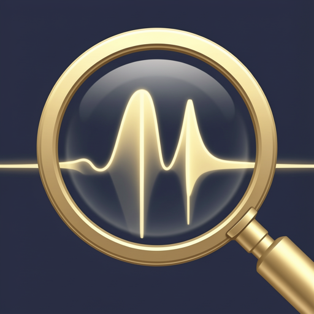

<p align="center">
  
</p>

<h1 align="center">SherlockEQ</h1>

<p align="center">
  Per-ear audio equalizer for macOS. Find a tinnitus tone, translate an audiogram, refine system audio — with precision other apps don't expose.
</p>

<p align="center">
  <a href="https://github.com/smbrownai/SherlockEQ/releases/latest"></a>
  <a href="LICENSE"></a>
  
  
</p>

<p align="center">
  <a href="https://snxt.ai">Website</a> ·
  <a href="https://github.com/smbrownai/SherlockEQ/releases/latest">Download</a> ·
  <a href="sherlockEQ-spec.md">Spec</a>
</p>

---

## What it does

macOS doesn't ship a per-ear parametric EQ. SherlockEQ is one. It taps system audio, splits the chain by ear, and adds three investigative tools on top:

- **Locate** — a continuous-phase sine sweep, fine-tunable to 1 Hz, that lets you find a tinnitus pitch and set a per-ear notch.
- **Interpret** — drag audiogram thresholds on a log-frequency chart; SherlockEQ converts them into a biquad EQ that compensates only where you have loss.
- **Refine** — two EQ surfaces, a 12-band graphic grid and a fully parametric canvas, with a live spectrum, a NIOSH equal-energy dose tracker, and AutoEQ-compatible headphone profiles.

A menu-bar popover surfaces live levels, today's dose, master gain, balance, and the notch toggle without opening the main window.

## How it works

- **Core Audio Tap API** reads system audio at the source. No virtual driver, no kernel extension, no audio routing to configure.
- **Custom per-ear biquad cascade**, derived from Audio EQ Cookbook formulas, runs in an `AVAudioSourceNode` render block. This bypasses `AVAudioUnitEQ`'s stereo coupling — a left-ear notch leaves the right channel untouched.
- **vDSP / Accelerate** for a 2048-point Hann-windowed FFT, the IEC 61672-1 A-weighting curve, and the dose math. The audio thread does a `memcpy` into a ring buffer; the FFT runs off-thread.
- **Stack up to 16 bands per ear.** Seven filter types: parametric, low/high shelf, notch, band/low/high pass.

## Install

**Direct download** (signed and notarized):

<https://github.com/smbrownai/SherlockEQ/releases/latest>

**Homebrew**:

```sh
brew tap smbrownai/sherlockeq
brew install --cask sherlockeq
```

Updates ship via [Sparkle](https://sparkle-project.org). If you installed via Homebrew, `brew upgrade --cask sherlockeq` picks them up instead and the in-app updater stands down.

## Requirements

- macOS 14.6 or later (Sonoma)
- Apple Silicon or Intel (universal binary)
- Permission: **Screen & System Audio Recording** (macOS requires this to capture audio from other processes; SherlockEQ does not record video or screen contents). It does **not** request Microphone access — it captures the system audio mix via the Core Audio Tap API, not an input device.

SherlockEQ is **not** in the Mac App Store — the App Store sandbox prohibits the cross-process audio read that the Tap API needs. The DMG is Apple-signed and notarized through the standard Developer ID program.

## Build from source

```sh
git clone https://github.com/smbrownai/SherlockEQ.git
cd SherlockEQ
open SherlockEQ.xcodeproj
```

Requires Xcode 15+ (Swift 5.9+). A Developer ID certificate is needed for signed/notarized builds.

To produce a signed, notarized DMG locally:

```sh
dist/release.sh <version>
```

The script archives a Release build, exports the `.app`, signs with your Developer ID, submits for notarization, staples the ticket, and writes a `.dmg` under `dist/build/`. See `dist/release.sh` for the full set of prerequisites and environment variables.

## Privacy

No telemetry. No account. No network calls except optional AutoEQ profile fetches (on demand) and Sparkle update checks. Profiles and settings live under `~/Library/Application Support/SherlockEQ/` and never leave the machine unless you export them.

## Not a medical device

SherlockEQ is not a health or medical application. It does not diagnose, treat, measure, or monitor any hearing condition, tinnitus, or disability. It is an audio equalizer for personal listening preferences. If you have concerns about your hearing, consult a doctor, audiologist, or licensed healthcare professional.

## On the name

Sherlocking is what happens when Apple ships a feature that copies an independent app. SherlockEQ is built around exactly the kind of system audio processing macOS does not expose. So: Apple, sherlock this. The author would consider that a win.

## License

[MIT](LICENSE) © 2026 Shawn M. Brown
